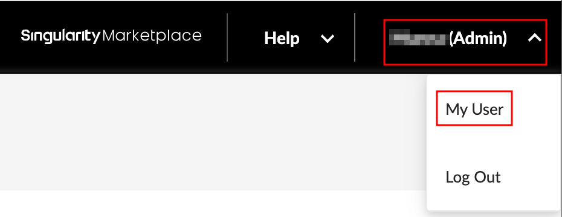
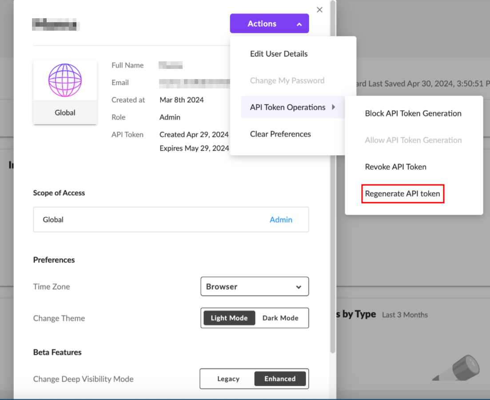
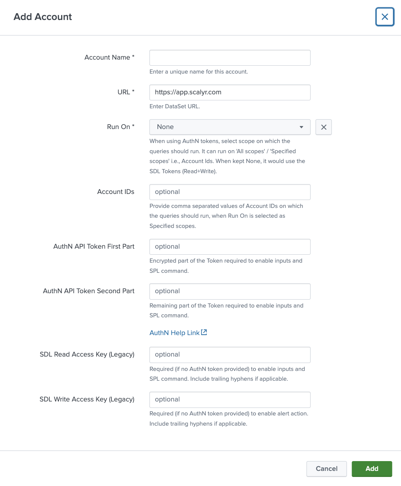

#  Singularity Data Lake Add-On for Splunk

   

The Singularity Data Lake Add-On for Splunk provides integration with [Singularity Data Lake](https://www.sentinelone.com/platform/xdr-ingestion/) and [DataSet](https://www.dataset.com) by [SentinelOne](https://sentinelone.com). The key functions allow two-way integration:
- SPL custom command to query directly from the Splunk UI.
- Inputs to index alerts as CIM-compliant, or any user-defined query results.
- Alert action to send events from Splunk.

## Installation
The add-on can be installed manually via the .tgz file in the [release directory](/release). Reference Splunk documentation for [installing add-ons](https://docs.splunk.com/Documentation/AddOns/released/Overview/Installingadd-ons). For Splunk Cloud customers, reference Splunk documentation for private app installation on [Classic Experience](https://docs.splunk.com/Documentation/SplunkCloud/latest/Admin/PrivateApps#Install_private_apps_on_Splunk_Cloud_Platform) or [Victoria Experience](https://docs.splunk.com/Documentation/SplunkCloud/latest/Admin/PrivateApps#Install_a_private_app_on_Classic_Experience).

For those looking to customize, the package subdirectory contains all artifacts. To compile, reference Splunk's [UCC Framework instructions](https://splunk.github.io/addonfactory-ucc-generator/how_to_use/) to use `ucc-gen` and `slim package`.

## Splunk Permission Requirements
The add-on uses Splunk encrypted secrets storage, so admins require `admin_all_objects` to create secret storage objects and users require `list_storage_passwords` capability to retrieve secrets.

### Splunk Enterprise
| Splunk component | Required | Comments |
| ------ | ------ | ------ |
| Search heads | Yes | Required to use the custom search command. |
| Indexers | No | Parsing is performed during data collection. |
| Forwarders | Optional | For distributed deployments, if the modular inputs are used, this add-on is installed on heavy forwarders. |

### Splunk Cloud
| Splunk component | Required | Comments |
| ------ | ------ | ------ |
| Search heads | Yes | Required to use the custom search command. Splunk Cloud Victoria Experience also handles modular inputs on the search heads. |
| Indexers | No | Parsing is performed during data collection. |
| Inputs Data Manager | Optional | For Splunk Cloud Classic Experience, if the modular inputs are used, this add-on is installed on an IDM. |

## Configuration
### Singularity Data Lake
1. From the SentinelOne console, ensure Enhanced Deep Visibility is enabled by clicking your name > My User > Change Deep Visibility Mode > Enhanced.

2. Open Enhanced Deep Visibility.
3. In the top left, ensure an account is selected (not `Global`)

4. Continue following the DataSet instructions below.

### Dataset (and Singularity Data Lake continued)
1. Make note of the URL (e.g. `https://app.scalyr.com`, `https://xdr.us1.sentinelone.net` or `https://xdr.eu1.sentinelone.net`). For SentinelOne users, note this differs from the core SentinelOne console URL.
2. Navigate to API Keys.

3. Under Log Access Keys, click Add Key > Add Read Key (required for search command and inputs).
4. Under Log Access Keys, click Add Key > Add Write Key (required for alert action).
5. Optionally, click the pencil icon to rename the keys.

### SentinelOne Platform with Singularity Data Lake
To get the AuthN API token follow the below mentioned details:
1. Login into the SentinelOne console, click on your User Name > My User

2. Click on Actions > API Token Operations > Generate / Regenrate API token.
    - If you are generating the API Token for the first time then you will have the Generate API Token option. Otherwise you will find the generate API Token.

3. Copy the API Token and save it for configuration.

### Splunk
1. In Splunk, open the Add-on

2. On the configuration > account tab:
- Click Add
- Enter a user-friendly account name. For multiple accounts, the account name can be used in queries (more details below).
- Enter the full URL noted above (e.g.: `https://app.scalyr.com`, `https://xdr.us1.sentinelone.net` or `https://xdr.eu1.sentinelone.net`).
- Select the "Run On" value, which can be 'All scopes', 'Specified scopes', or 'None'.
    - If set to **All scopes**, the queries will run for the entire tenant.
    - If set to **Specified scopes**, provide Account IDs as comma-separated values to run searches in those specific accounts.
    - Leave it to the default value of **None** if you are not trying to use tenant-level searches; in this case, you need to provide one of the legacy API tokens.
- Provide the comma seperated Account Ids, if "Run On" is set to **Specified scopes**. eg: 1234567890,9876543210.
- Enter the AuthN API Token First part which includes first 220 characters.
- Enter the AuthN API Token Second part which includes remaining characters.
    - Use this command to prepare both parts of AuthN API token:
    `read -p "Enter Token: " input_string && echo "Part1: $(echo $input_string | cut -c 1-220)"; echo "Part2: $(echo $input_string | cut -c 221-)"`
    - Reason for creating 2 parts of AuthN Token: Splunk Storage Manager has a limitation of storing only 256 characters of encrypted data from inputs. And the AuthN Token can have length <256, hence its split into 2 parts, the first one is encrypted (first 220 chars) and the second one is not. As we are encrypting most of the Token, its use is safe.
- Enter the SDL read key from above (required for searching), please ignore this if AuthN token value is provided.
- Enter the SDL write key from above (only required for alert actions).
- Click Save

3. Optionally, configure logging level and proxy information on the associated tabs.
4. Click Save.
5. The included Singularity Data Lake by Example dashboard can be used to confirm connectivity and also shows example searches to get started.

## SPL Command
The `| dataset` command allows queries against the [DataSet APIs](https://app.scalyr.com/help/api) directly from Splunk's search bar.

Optional parameters are supported:

- **account** - If multiple accounts are used, the account name as configured in setup can be specified (`emea` in the screenshot above). If multiple accounts are configured but not specified in search, the first result (by alphanumeric name) is used. To search across all accounts, `account=*` can be used.
- **method** - Define `query`, `powerquery`, `facet` or `timeseries` to call the appropriate REST endpoint. Default is query.
- **query** - The DataSet [query](https://app.scalyr.com/help/query-language) filter used to select events. Default is no filter (return all events limited by time and maxCount).
- **starttime** - The Splunk time picker can be used (not "All Time"), but if starttime is defined it will take precedence to define the [start time](https://app.scalyr.com/help/time-reference) for DataSet events to return. Use epoch time or relative shorthand in the form of a number followed by d, h, m or s (for days, hours, minutes or seconds), e.g.: `24h`. Default is 24h.
- **endtime** - The Splunk time picker can be used (not "All Time"), but if endtime is defined it will take precedence to define the [end time](https://app.scalyr.com/help/time-reference) for DataSet events to return. Use epoch time or relative shorthand in the form of a number followed by d, h, m or s (for days, hours, minutes or seconds), e.g.: `5m`. Default is current time at search.

For query and powerquery:
- **maxcount** - Number of events to return.
- **columns** - Specified fields to return from DataSet query (or powerquery, analogous to using `| columns` in a powerquery). Yields performance gains for high volume queries instead of returning and merging all fields.

For facet:
- **field** - Define field to get most frequent values of. Default is logfile.

For timeseries:
- **function** - Define value to compute from matching events. Default is rate.
- **buckets** - The number of numeric values to return by dividing time range into equal slices. Default is 1.
- **createsummaries** - Specify whether to create summaries to automatically update on ingestion pipeline. Default is true; recommend setting to false for one-off or while testing new queries.
- **useonlysummaries** - Specify whether to only use preexisting timeseries for fastest speed.

For all queries, be sure to `"`wrap the entire query in double quotes, and use `'`single quotes`'` inside`"` or double quotes `\"`escaped with a backslash`\"`, as shown in the following examples.

For powerqueries using timebucket functions, return the time field as `timestamp`. This field is use to timestamp events in Splunk as `_time`.

### Search Examples
Query Example:
`| dataset method=query search="serverHost = * AND Action = 'allow'" maxcount=50 starttime=10m endtime=1m`

Power Query Example 1: `| dataset method=powerquery search="dataset = \"accesslog\"
| group requests = count(), errors = count(status == 404) by uriPath
| let rate = errors / requests
| filter rate > 0.01
| sort -rate"`

Power Query Example 2: `| dataset account=emea method=powerQuery search="$serverHost == 'cloudWatchLogs'
| parse 'RequestId: $RID$ Duration: $DUR$ ms Billed Duration: $BDUR$ ms Memory Size: $MEM$ MB Max Memory Used: $UMEM$ MB'
| let deltaDUR= BDUR - DUR, deltaMEM = MEM - UMEM
| sort -DUR
| columns 'Request ID' = RID, 'Duration(ms)' = DUR, 'Charged delta (ms)' = deltaDUR, 'Used Memory (MB)' = UMEM, 'Charged delta Memory (MB)' = deltaMEM" starttime=5m`

Facet Query Example:
`
| dataset account=* method=facet search="serverHost = *" field=serverHost maxcount=25
| spath
| table value, count
`

Timeseries Query Example:
`
| dataset method=timeseries search="serverHost='scalyr-metalog'" function="p90(delayMedian)" starttime="24h" buckets=24 createsummaries=false onlyusesummaries=false
`

Since events are returned in JSON format, the Splunk [spath command](https://docs.splunk.com/Documentation/SplunkCloud/latest/SearchReference/Spath) is useful. Additionally, the Splunk [collect command](https://docs.splunk.com/Documentation/Splunk/latest/SearchReference/collect) can be used to add the events to a summary index:

`
| dataset query="serverHost = * AND Action = 'allow'" maxcount=50 starttime=10m endtime=1m
| spath
| collect index=dataset
`

## Inputs
For use cases requiring data indexed in Splunk, optional inputs are provided utilizing time-based checkpointing to prevent reindexing the same data:

| Source Type | Description | CIM Data Model |
| ------ | ------ | ------ |
| dataset:alerts | Predefined Power Query API call to index [alert state change records](https://app.scalyr.com/help/alerts#logging)  | [Alerts](https://docs.splunk.com/Documentation/CIM/latest/User/Alerts) |
| dataset:query | User-defined standard [query](https://app.scalyr.com/help/api#query) API call to index events | - |
| dataset:powerquery | User-defined [PowerQuery](https://app.scalyr.com/help/api#powerquery) API call to index events | - |

1. On the inputs page, click Create New Input and select the desired input

2. For DataSet alerts, enter:

- A name for the input.
- Interval, in seconds. A good starting point is `300` seconds to collect every five mintues.
- Splunk index name
- Start time, in relative shorthand form, e.g.: `24h` for 24 hours before input execution time.

3. For DataSet queries, enter:

- A name for the input.
- Interval, in seconds. A good starting point is `300` seconds to collect every five mintues.
- Splunk index name
- Start time, in relative shorthand form, e.g.: `24h` for 24 hours before input execution time.
- *(optional)* End time, in relative shorthand form, e.g.: `5m` for 5 minutes before input execution time.
- *(optional)* Query string used to return matching events.
- *(optional)* Maximum number of events to return.

4. For DataSet Power Queries, enter:
- A name for the input.
- Interval, in seconds. A good starting point is `300` seconds to collect every five mintues.
- Splunk index name
- Start time, in relative shorthand form, e.g.: `24h` for 24 hours before input execution time.
- *(optional)* End time, in relative shorthand form, e.g.: `5m` for 5 minutes before input execution time.
- Query string used to return matching events, including commands such as `| columns`, `| limit`, etc.

## Alert Action
An alert action allows sending an event to the DataSet [addEvents API](https://app.scalyr.com/help/api#addEvents).

## Support and troubleshooting
SentinelOne Data Lake users are able to see meta logs, such as search actions, but no endpoint data in Splunk - Ensure the read API token was provisioned from an account, not Global.

Error saving configuration "CSRF validation failed" - This is a Splunk browser issue; try reloading the page, using a private window or clearing cache and cookies then retrying.

Search errors `Account token error, review search log for details` or `Splunk configuration error, see search log for details.` - API token was unable to be retrieved. Common issues include user role missing list_storage_passwords permission, API token not set or incorrect account name given that has not been configured. Review job inspector search log for errors returned by Splunk. `Error retrieving account settings, error = UrlEncoded('broken')` indicates a likely misconfigured or incorrect account name; `splunklib.binding.HTTPError: HTTP 403 Forbidden -- You (user=username) do not have permission to perform this operation (requires capability: list_storage_passwords OR admin_all_objects)` indicates missing Splunk user permissions (list_storage_passwords).

To troubleshoot the custom command, check the Job Inspector search log, also available in the internal index: `index=_internal app="TA_dataset" sourcetype=splunk_search_messages`.

For support, open a ticket with SentinelOne or DataSet support, including any logged errors.

## Additional Notes
Though not typically an issue for users, DataSet does have [API rate limiting](https://app.scalyr.com/help/api#rateLimiting). If issues are encountered, open a case with support to review and potentially increase limits.

DataSet API PowerQueries limit search filters to 5,000 characters.

If Splunk events all show the same time, ensure results are returning a `timestamp` field. This is used to timestamp events as _time in Splunk.

##### Note
This add-on was built with the [Splunk Add-on UCC framework](https://splunk.github.io/addonfactory-ucc-generator/) and uses the [Splunk Enterprise Python SDK](https://github.com/splunk/splunk-sdk-python).
Splunk is a trademark or registered trademark of Splunk Inc. in the United States and other countries.

## Development

For information on development and contributing, please see [CONTRIBUTING.md](CONTRIBUTING.md).

## Security

For information on how to report security vulnerabilities, please see [SECURITY.md](SECURITY.md).

## Permissions

Required permissions in Splunk 

-  search
-  list_all_objects
-  list_storage_passwords
-  rest_properties_get
-  admin_all_objects
-  list_storage_passwords

## Copyright, License, and Contributors Agreement

Copyright 2023 SentinelOne, Inc.

Licensed under the Apache License, Version 2.0 (the "License"); you may not use this work except in
compliance with the License. You may obtain a copy of the License in the [LICENSE](LICENSE.txt) file, or at:

[http://www.apache.org/licenses/LICENSE-2.0](http://www.apache.org/licenses/LICENSE-2.0)
